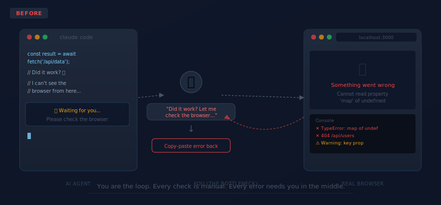
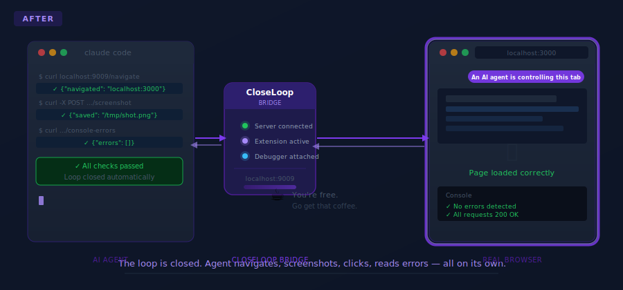
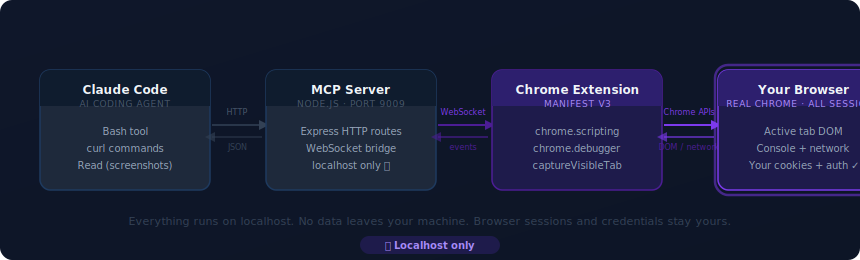
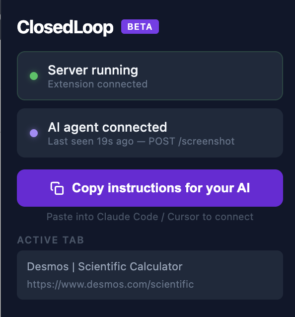

<div align="center">

# ☕ CloseLoop

### Your AI agent is staring at a blank browser. You shouldn't have to be.

<br/>

> **⚠️ Public Beta — built for hobbyists and tinkerers.**
> Expect rough edges. Works great. Not production-hardened. Ship it anyway.

<br/>

CloseLoop gives your AI coding agent your **real, signed-in Chrome browser** — the one with your cookies, your sessions, your localhost app running.
It navigates. It clicks. It types. It screenshots. It reads console errors.
**You go get another coffee.**

<br/>

[](LICENSE)
[](https://github.com/ncarmont/closeloop)


</div>

---

## 😤 You know this loop

Agent writes code → you open browser → nothing rendered → you copy the error → paste it back → agent fixes it → you check again → repeat × 12.

You're not the developer anymore. **You're the browser intern.**

<br/>

<div align="center">

</div>

<br/>

## ☕ Close the loop

CloseLoop connects your agent directly to a live Chrome tab over a secure local bridge.
The agent navigates, screenshots, clicks, types, and reads its own errors — **all without you lifting a finger.**

<br/>

<div align="center">

</div>

---

## 🌀 How It Works

<br/>

<div align="center">

</div>

<br/>

Two pieces. One bridge. Zero babysitting.

**🧩 Chrome Extension** — Manifest V3 extension that receives commands over a local WebSocket and executes them in your real browser tab using native Chrome APIs. Highlights elements before clicking them. Shows a live action feed in a side panel.

**🖥️ MCP Server** — Node.js server (`localhost:9009`) that bridges your agent and the extension. The agent calls it with `curl`. Results come back as JSON.

Your browser sessions, cookies, and auth tokens **never leave your machine**. Everything is localhost.

---

## 👀 What You See While the Agent Works

The moment your agent takes control, your browser tells you about it:

**✨ Animated banner** — a gradient pill at the top of the page reading *"An AI agent is controlling this browser tab"* slowly sweeps through purple hues so you always know the agent is driving.

**🟡 Element spotlight** — before every click or keystroke, the target element gets an amber glow, a badge saying exactly what's about to happen, and a 2-second countdown bar. You see every move before it fires.

**✅ Confirmation flash** — clicks go green (`✓ Clicking!`), type actions go blue (`✎ Typing…`) for a beat before the action fires.

**📋 Live side panel** — every action logged in real time with timestamps and inline screenshot previews. Auto-clears on every new session.

**⚠️ Approval prompts** — for anything risky, the agent can pause and ask you to approve in the side panel before proceeding. A pulsing amber bubble appears in the center of the screen pointing you there.

<div align="center">
<br/>

<br/>
<em>Element spotlight + agent banner on the demo calculator page.</em>
<br/><br/>

<br/>
<em>The extension popup — green dot means connected, action log updates in real time.</em>
</div>

---

## 🛠️ What the Agent Can Do

| Endpoint | What It Does |
|----------|-------------|
| `POST /navigate` | Navigate to any URL, waits for full page load |
| `POST /screenshot` | Capture a PNG → saved to `/tmp/closedloop-screenshot.png` |
| `GET /context` | URL, title, body text, + up to 40 interactive elements with CSS selectors |
| `POST /click` | Click any element by CSS selector — highlights it first |
| `POST /type` | Type into any input (React-compatible, clears first) |
| `POST /attach-debugger` | Attach Chrome DevTools Protocol — enables error capture |
| `GET /console-errors` | All JS errors + exceptions since last attach |
| `GET /network-errors` | All 4xx/5xx + failed requests since last attach |
| `POST /request-approval` | Pause and ask the user to approve before proceeding |
| `POST /toggle-mobile` | Switch to mobile viewport (iPhone 15 Pro) and back |
| `GET /status` | Server health + extension connection state |

---

## ⚡ Quick Start

> **Takes about 3 minutes. Then go make a coffee.**

### 1️⃣ Clone and install

```bash
git clone https://github.com/ncarmont/closeloop.git
cd closeloop
bash setup.sh
```

### 2️⃣ Start the server

```bash
node mcp-server/server.js
# ✓ Server running at http://localhost:9009
# ✓ Waiting for Chrome extension...
```

### 3️⃣ Load the Chrome extension

1. Open Chrome → `chrome://extensions`
2. Enable **Developer mode** (top-right toggle)
3. Click **Load unpacked** → select the `extension/` folder
4. Pin the CloseLoop icon — badge turns **green** when connected

### 4️⃣ Point your agent at it

Click **"Copy instructions for your AI"** in the popup and paste into Claude Code (or any agent with a Bash tool). Done. Your agent now has full browser access.

---

## 🧪 Try the Demo

A **broken calculator** ships in `demo/calculator/`. It has intentional bugs. Ask your agent to find them, fix them, and verify the fix — without you touching the browser once.

```
"Open the demo calculator at file:///YOUR_PATH/closeloop/demo/calculator/index.html,
find what's broken, fix it, and verify it works — all in the browser."
```

Watch the side panel. Watch the highlights. Go get a coffee.

---

## 🔒 Security

This is a **local-only tool**. Here's what that means in practice:

- 🔐 The WebSocket server binds to `127.0.0.1` — **never exposed to the network**
- 🍪 Your browser sessions, cookies, and auth tokens stay on your machine
- 🚫 No cloud relay, no telemetry, no remote control surface
- ✅ The extension uses `"host_permissions": ["<all_urls>"]` — required for scripting and debugger APIs, standard for browser automation

---

## ⚠️ Beta Disclaimer

CloseLoop is a **hobbyist project in public beta**. It works well for personal use and tinkering with AI agents. A few honest notes:

- 🚧 Not production-hardened — don't run this on a shared or corporate machine
- 🐛 Rough edges exist — file an issue if something bites you
- 🔓 The agent has real browser access — use `/request-approval` for anything destructive
- 💡 Built for Claude Code but works with any agent that can run `curl`

If it breaks, [open an issue](https://github.com/ncarmont/closeloop/issues). If it saves you an hour of babysitting, give it a ⭐.

---

## 📐 Project Structure

```
closeloop/
├── extension/             Chrome Manifest V3 extension
│   ├── background.js      Service worker — WebSocket client, all command handlers
│   ├── popup.html/js      Extension popup — status, screenshot preview
│   ├── sidepanel.html/js  Live action feed (native Chrome side panel)
│   └── manifest.json
├── mcp-server/
│   └── server.js          Express + WebSocket bridge on port 9009
├── demo/
│   └── calculator/        Intentionally broken calculator — use it to test
└── .claude/
    └── skills/closeloop/  Claude Code skill — invoke with /closeloop
```

---

## 📋 Requirements

- Node.js 18+
- Google Chrome 114+
- Any AI agent with a Bash tool (Claude Code, Cursor, Cline, Zed, etc.)

---

## 📄 License

MIT — see [LICENSE](LICENSE)

---

<div align="center">

**CloseLoop** · Built for developers who have better things to do than babysit their agent.

*The loop is closed. Go get that coffee. ☕*

</div>
